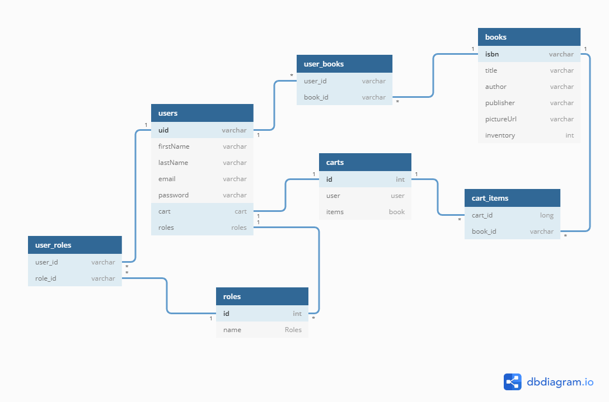
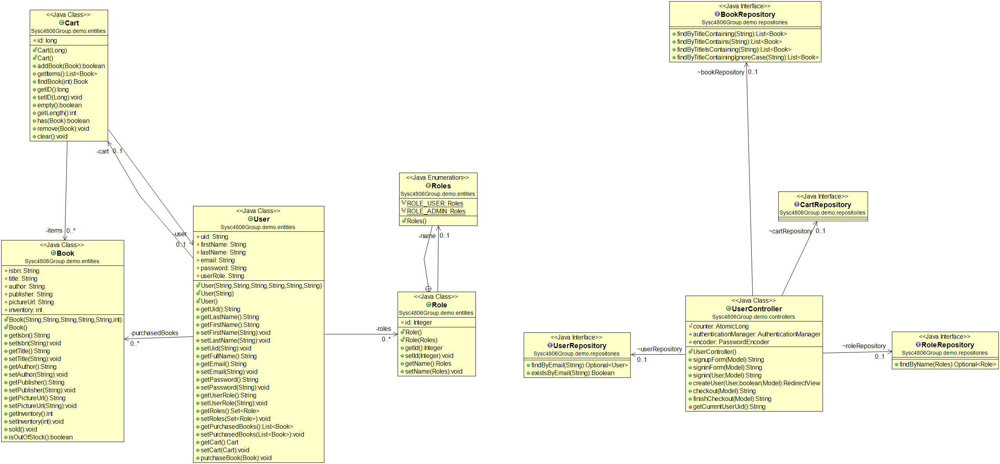

# Amazin online bookstore

## Group 7

### Team Members

    Hamna Nimra Manzoor
    Abhiram Santhosh
    Sai Vikranth Desu
    Dhyan Pathak
    Karanvir Chaudhary

## System Description:

Java Spring web application that allows customers to buy books online.
The App allows the admin to manage the bookstore and implements Access Control Rights Role Based.
Everything in the application is simulated.

## System Tools:

    Travis CI: Continuous Integration
    Heroku: Deployment
    Github: Version COntrol
    Clubhouse: Product Tracking

## Database Schema:

## UML Class Diagram:

